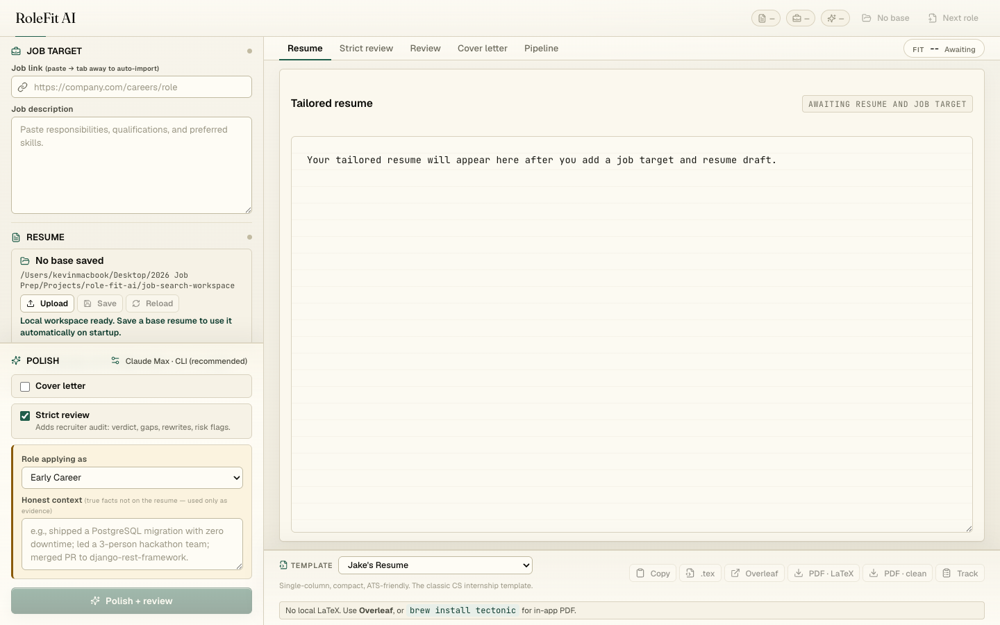

# RoleFit AI

A **local-first** resume tailoring webapp. Paste a job link, pull your base resume from your workspace, get a polished draft scored against the job description, and export to LaTeX / DOCX / PDF — without your data leaving your machine.

> Built for an entry-level SDE job hunt: tight workflow loop, blunt recruiter-style audit before applying, and a local pipeline tracker so you never lose track of a role.



## Highlights

- **Multi-format resume I/O** — ingest `.docx`, `.pdf`, `.tex` (Jake's-style), or plain text; export back to each.
- **Multi-provider AI** — 10 backends, including **subscription-CLI providers** (`Claude Code`, `Codex CLI`) that route through existing Claude Max / ChatGPT Plus subscriptions instead of per-token API billing.
- **Fit scoring + 4-category keyword gap analysis** — required experience, knowledge, required skills, technical tools.
- **Strict recruiter review mode** — verdict (STRONG FIT / REASONABLE FIT / STRETCH / DON'T APPLY), gap severity, targeted bullet rewrites, interview risk flags, cover-letter angle.
- **LaTeX export pipeline** with three resume templates (Jake's, Awesome-CV, Deedy) + **one-click Overleaf submission** via form POST + optional local PDF compile through **Tectonic**.
- **DOCX format preservation** through direct OpenXML paragraph edits.
- **On-disk pipeline tracker** with status / source / company / role / follow-up date / notes / resume snapshot per application — survives browser wipes.
- **Local-first** — workspace lives in `job-search-workspace/` and never touches the network; API keys stay server-side in `.env`.

## Stack

React 19 · TypeScript · Vite · Node.js (single-file `server.mjs` with Vite middleware in dev) · custom CSS · `lucide-react` icons

No SaaS dependencies. Optional integrations: OpenAI · Anthropic · Gemini · OpenRouter · Groq · Together · Mistral · local Ollama · Claude Code CLI · Codex CLI · Tectonic · Overleaf.

## Run

```bash
npm install
npm run dev
```

Visit `http://localhost:5174`.

## AI setup

Pick a provider in the app's **Advanced AI settings** panel, or set a key in `.env`:

```bash
# pick one (or set multiple and switch in-app)
OPENAI_API_KEY=...
ANTHROPIC_API_KEY=...
GEMINI_API_KEY=...
GROQ_API_KEY=...
OPENROUTER_API_KEY=...
TOGETHER_API_KEY=...
MISTRAL_API_KEY=...
```

For **zero per-token cost**, use the subscription-CLI providers (default):

```bash
# requires Claude Max
brew install claude-code   # or via the official installer
claude auth login

# requires ChatGPT Plus / Codex Plus
brew install codex
codex login
```

The app shells out to these CLIs for polish requests — no API key required.

## Optional local LaTeX

```bash
brew install tectonic
```

When installed, the `PDF · LaTeX` button in the export rail compiles your polished `.tex` directly to PDF in-app. Without it, use the **Overleaf** button instead — one click sends the `.tex` to a new Overleaf tab for compile.

## Workspace

The app creates `job-search-workspace/` for your private local data:

- `base-resume.docx` (or `.tex`, `.txt`, `.md`, `.csv`) — auto-loaded on startup
- `applications.json` — the pipeline tracker's on-disk store
- Anything else you drop in there

This folder is gitignored except its README. Personal resumes, PDFs, and DOCX files at the repo root are also gitignored as a privacy guard.

## Project layout

```
server.mjs                       # main HTTP server
server/
  ai-cli/index.mjs               # Claude Code / Codex CLI shell-out
  applications/index.mjs         # pipeline tracker storage
  latex/                         # parser + 3 template renderers + optional Tectonic compile
src/
  App.tsx                        # state + handlers + composition
  hooks/{useApplications, useTemplates}.ts
  sections/                      # Masthead / SourcesPane / StudioPane / ExportRail
  sections/tabs/                 # Resume / Review / StrictReview / CoverLetter / Pipeline
  resumeEngine.ts                # scoring + analysis + deterministic local fallback
  pdfResume.ts                   # clean ATS PDF template
docs/engineering/                # contributor notes (server, UI, git workflow, testing)
job-search-workspace/            # local-only; gitignored except README
```

## Scripts

```bash
npm run dev        # start API + Vite middleware on :5174
npm run build      # tsc + vite production build
npm run preview    # serve the production build locally
```

## License

[MIT](LICENSE) © Xinyi Lin
