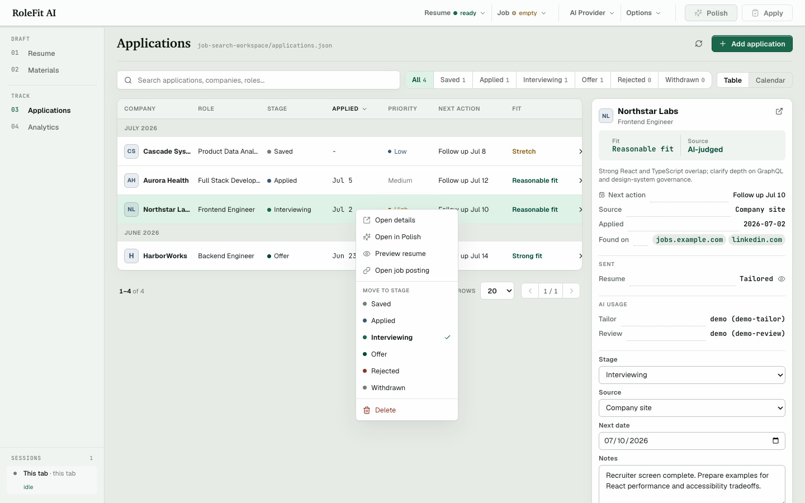
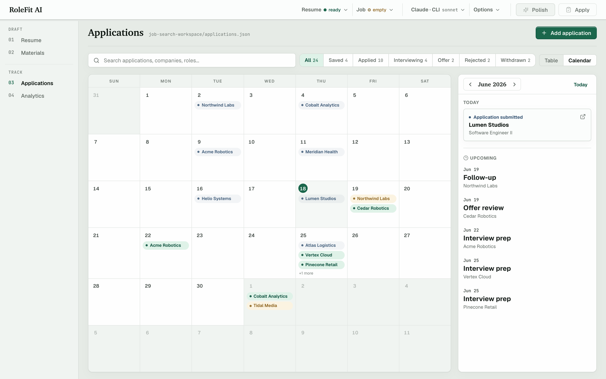
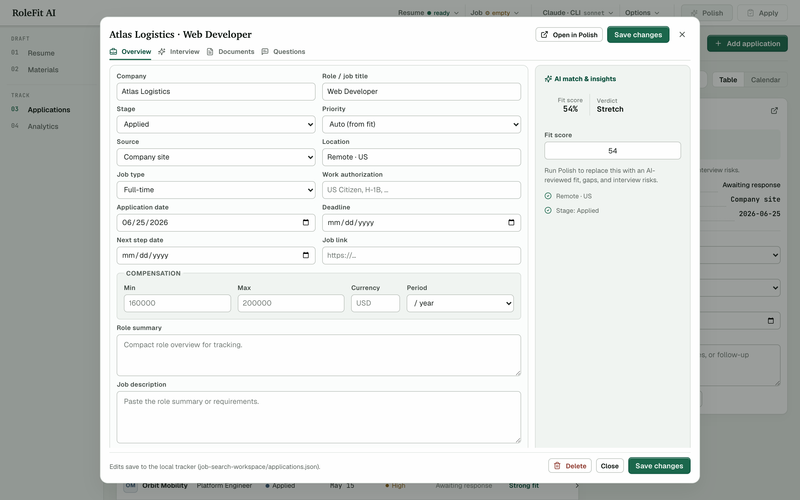

# RoleFit AI

A **local-first** resume tailoring webapp. Import a job posting (paste it, or pull it straight from the link), tailor your base resume from your workspace, score the draft against the job description, and export to LaTeX / PDF — without storing your personal data in a hosted app.

> Built for an entry-level SDE job hunt: tight workflow loop, blunt recruiter-style audit before applying, and a local pipeline tracker so you never lose track of a role.


The on-disk **application tracker** — a sortable, paginated table with right-click quick actions, plus a calendar of submissions and follow-ups:

<table>
<tr>
<td width="50%"></td>
<td width="50%"></td>
</tr>
<tr>
<td width="50%"></td>
<td width="50%"></td>
</tr>
</table>

_Screenshots use demo workspace data._

> **Recommended path:** keep your base resume as a **`.tex`** file (Jake's-style) and export with **PDF · LaTeX** for faithful, ATS-clean formatting. DOCX, LaTeX, and plain-text sources also work, but their **PDF · clean** export is a best-effort render and may need more manual editing/formatting.

## Highlights

- **Multi-format resume I/O** — ingest `.docx`, `.tex` (Jake's-style), or plain text; paste extracted PDF text when the original file is only available as PDF.
- **Job-link import** — paste a posting URL and pull the description in one click: Workday-aware (reads its CXS JSON API for `/job/` and `/details/` links), with a generic HTML→text fallback for other boards. The posting is distilled before polishing — **AI-first** via the configured provider (anti-fabrication grounded server-side), with the deterministic engine as an offline fallback — keeping role intro / responsibilities / requirements / preferred qualifications while dropping empty bullets, duplicated ATS title furniture, low-value Workday metadata, apply/share/navigation rows, company/culture marketing, salary pills, benefits/perks, pay-transparency, and EEO/legal boilerplate. The link itself is kept only for pipeline tracking and is **never sent to the model**.
- **Browser extension (Chrome/Firefox)** — on any job posting, click the toolbar icon for an instant **local fit score** (a keyword-overlap estimate against your base resume), **matched vs missing** keywords, a check on whether you've **already tracked or applied** to that exact posting, and a one-click **Import** that opens a fresh RoleFit tab, distills the page into that tab's Job field server-side, and keeps any existing tailoring session untouched — with an optional **Tailor automatically** toggle that jumps straight to polish once your base resume is loaded. Manifest V3; the extension talks only to your local `http://localhost:5181` server, while AI-backed import/polish still uses whichever local CLI, hosted API, or local model you configure. See [Browser extension](#browser-extension).
- **Subscription-friendly, multi-provider AI** — the default is the **Claude Code CLI** path (any **Claude Pro or Max** plan), with the other **account-backed CLI tools** (`Codex CLI`, `Antigravity CLI`) running on your existing **ChatGPT** or **Google Antigravity** account — including their **free tiers** — instead of per-token billing, and **hosted-API backends** (OpenAI, Anthropic, Gemini, OpenRouter, Groq, Together, Mistral, local Ollama) available behind the same interface. The AI menu keeps separate provider/model controls for Distill, Tailor, and Review, with copy buttons when you want all stages aligned.
- **Fit scoring + 4-category keyword gap analysis** — required experience, knowledge, required skills, technical tools.
- **Strict recruiter review mode** — verdict (STRONG FIT / REASONABLE FIT / STRETCH / DON'T APPLY), base-vs-tailored fit scores, gap severity, targeted bullet rewrites, interview risk flags, ready / edits-pending / missing-evidence status, and a cover-letter angle.
- **LaTeX export pipeline (recommended)** built on a Jake's-style resume template + optional local PDF compile through **Tectonic** — the recommended path for faithful, ATS-clean output.
- **DOCX import** — ingest a `.docx` base resume; its content is parsed into the structured editor (export is via the LaTeX/PDF paths above, not DOCX).
- **Clean PDF export (no LaTeX needed)** — the tailored resume renders as HTML and prints through your browser's **Save as PDF**, keeping the text selectable for ATS parsing. A universal fallback for any source; for pixel-faithful formatting, prefer the LaTeX export.
- **On-disk pipeline tracker** — a sortable, paginated applications table (right-click any row for quick actions: open details, change stage, in-app PDF preview of the saved resume, or delete) alongside a calendar view of submissions and upcoming follow-ups. Tracks status / source / company / role / follow-up date / notes / resume snapshot per application, and survives browser wipes.
- **Local-first personal workflow** — the app, server, extension bridge, and workspace files run on your own device; workspace files live in `job-search-workspace/`, and API keys stay server-side in `.env`. AI-backed import, polish, cover-letter, and application-answer features send the relevant job/resume text through the provider or CLI you choose; use a local model for fully local inference.

## Stack

React 19 · TypeScript · Vite · Node.js (`server.mjs` with focused helpers under `server/`) · custom CSS · `lucide-react` icons

No SaaS dependencies. Optional integrations: OpenAI · Anthropic · Gemini · OpenRouter · Groq · Together · Mistral · local Ollama · Claude Code CLI · Codex CLI · Antigravity CLI · Tectonic.

## Run

```bash
npm install
npm run dev
```

Visit `http://localhost:5181`.

## AI setup

Pick providers/models from the top-bar AI menu, or set keys in `.env`. The menu is split by pipeline stage:

- **Distill** — job-link, paste, and import distillation into a compact job brief.
- **Tailor** — resume rewrite, cover letter, and application-answer drafting.
- **Review** — strict recruiter-style audit and reviewer rewrites.

Each stage has its own provider/model/effort settings; use **Copy from** in the menu to sync one stage from another. API keys typed into the menu are one-session values and are not saved. Keys in `.env` stay server-side:

```bash
# pick one (or set multiple and switch in-app)
OPENAI_API_KEY=...
ANTHROPIC_API_KEY=...
GEMINI_API_KEY=...
GROQ_API_KEY=...
OPENROUTER_API_KEY=...
TOGETHER_API_KEY=...
MISTRAL_API_KEY=...
```

For **zero per-token cost**, use the account-based CLI providers (the default is the Claude Code CLI; override with `AI_PROVIDER` or the in-app AI menu):

```bash
# works with any Claude Pro or Max plan
brew install claude-code   # or via the official installer
claude auth login

# works with any ChatGPT plan, including the free tier (local tasks, usage-limited)
brew install codex
codex login

# works with Google Antigravity (free tier or subscription)
# install the Antigravity CLI (`agy`), then sign in
agy auth login
```

The app shells out to these CLIs for AI-backed import, polish, cover-letter, and application-answer requests — no API key required. The app is still local-first and personal-use: you run the server on your own machine, and the CLI auth/session stays tied to that device. For fully local inference, point the Local/custom provider at a local OpenAI-compatible server such as Ollama.

> **Tested providers:** all three subscription CLIs — **Claude Code**, **Codex**, and **Antigravity** (`agy`) — plus the **OpenAI** hosted API have been exercised end-to-end. The remaining hosted-API routes (Anthropic, Gemini, OpenRouter, Groq, Together, Mistral, and local Ollama) share the same request path but have **not** been tested — treat them as best-effort.

## Optional local LaTeX

```bash
brew install tectonic
```

When installed, the `PDF · LaTeX` button in the export rail compiles your polished `.tex` directly to PDF in-app. Without it, use **PDF · clean** (the tailored resume prints through your browser's Save as PDF) or download the `.tex` to compile in your own LaTeX toolchain.

## Browser extension

A lightweight Chrome/Firefox popup that brings the fit check to the job board. On any posting, click the **RoleFit AI** toolbar icon to see:

- an **estimated fit score** — a local keyword-overlap estimate against your base resume (the real AI verdict still comes from polishing in the app),
- the **matched vs missing** keywords for that role,
- whether you've **already tracked or applied** to that exact posting (matched by normalized URL), and
- a one-click **Import to RoleFit AI** that opens a fresh independent RoleFit tab and distills the page text into that tab's Job field (server-side, AI-first with a deterministic fallback), with an optional **Tailor automatically after import** toggle that runs the polish as soon as the brief and your base resume are ready.

It is Manifest V3 and talks **only** to your local server at `http://localhost:5181`: the routes it calls accept extension-origin requests only (with a reflected, non-wildcard CORS origin), and the inbox the app reads is same-origin and CSRF-guarded. The local server may then run the configured AI distiller for imports, so posting text can go through the app's Distill-stage CLI/API provider unless you choose a local model or the deterministic fallback path. Imports carry a short local claim token so the newly-opened tab receives its own posting, while other open tabs continue their current jobs; the app also shows a small read-only "other sessions" card when another tab is active. The quick score reports only overlap of known tech keywords; it never invents resume content.

Start the app first (`npm run dev`), then load the unpacked extension:

- **Chrome / Edge** — open `chrome://extensions`, enable **Developer mode**, click **Load unpacked**, and select the `extension/` folder.
- **Firefox** — open `about:debugging#/runtime/this-firefox`, click **Load Temporary Add-on…**, and select `extension/manifest.json`.

## Workspace

The app creates `job-search-workspace/` for your private local data:

- `base-resume.docx` (or `.tex`, `.txt`, `.md`, `.csv`) — auto-loaded on startup
- `applications.json` — the pipeline tracker's on-disk store
- Anything else you drop in there

This folder is gitignored except its README. Personal resumes, TEX/PDF/DOCX files, and root-level resume artifacts are also gitignored as a privacy guard.

## Project layout

```
server.mjs                       # main HTTP server
server/
  ai/                            # /api/polish + /api/distill: polish/distill (routes) + providers,
                                 #   clients, prompts, sanitize, grounding, json, errors,
                                 #   coverLetter + applicationAnswers
  ai-cli/index.mjs               # Claude Code / Codex / Antigravity CLI shell-out
  applications/index.mjs         # pipeline tracker storage
  docx.mjs                       # DOCX import helpers (extract → editor)
  extension/index.mjs            # browser-extension API: quick fit score + applied-status lookup
  http.mjs                       # JSON/body/fetch utilities
  latex/                         # parser + Jake's template renderer + optional Tectonic compile
  network.mjs                    # job-link fetch + SSRF guards
src/
  App.tsx                        # state + handlers + composition
  config/aiOptions.ts            # provider/model/reasoning options
  hooks/                          # templates, applications, per-tab autosave/presence, resume export/analysis, AI settings, answers
  lib/                           # downloads, job extraction/distilling, resume format/block + LaTeX→HTML render helpers
  sections/                      # Masthead + nav menus (Resume/Job/AI/Options/Polish) / StudioPane / ExportRail / ReviewRail / ResumeDocument / ResumePrintLayer
  sections/editor/               # structured resume editor (sections, entries, bullets, skills rows)
  sections/tabs/                 # Resume / Materials / Applications / Analytics
  resume/                        # resume engine split: types, text, keywords, scoring, rewrite, diff
  resumeEngine.ts                # barrel re-exporting src/resume/* (scoring/analysis/deterministic fallback)
  styles/                        # per-surface CSS + shared tokens
extension/                       # Chrome/Firefox MV3 popup (one-click import, fit score, applied status)
docs/engineering/                # contributor notes (server, UI, git workflow, testing)
job-search-workspace/            # local-only; gitignored except README
```

## Scripts

```bash
npm run dev        # start API + Vite middleware on :5181
npm run build      # tsc + vite production build
npm run preview    # serve the production build locally
```

## License

[MIT](LICENSE) © Xinyi Lin
