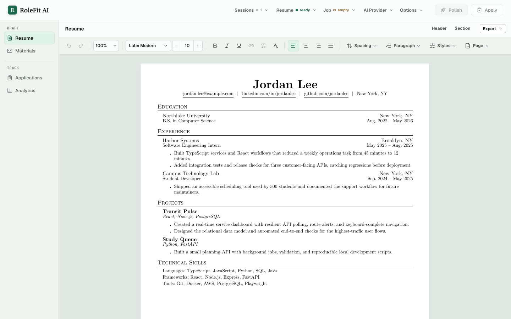
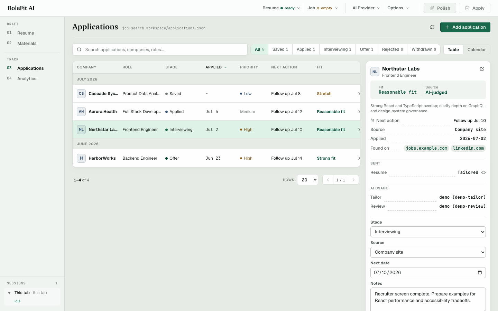
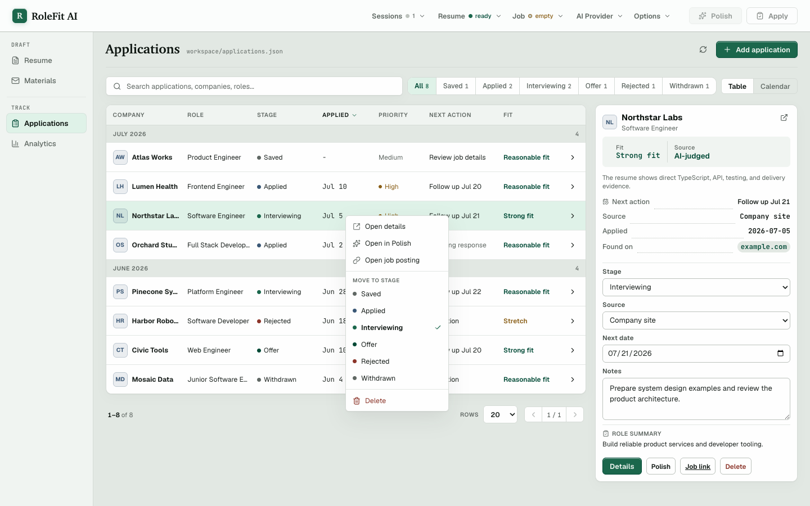
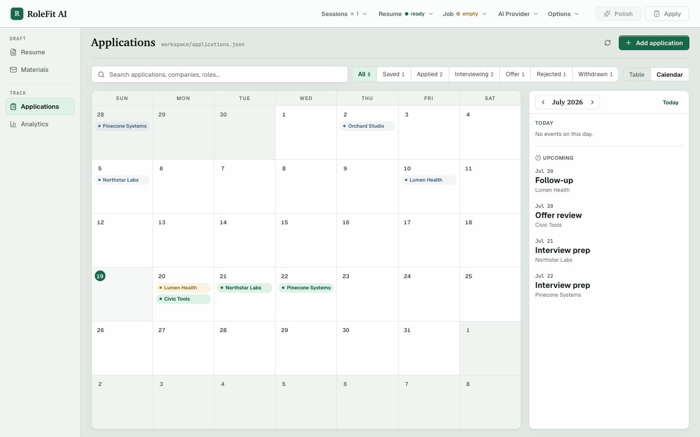
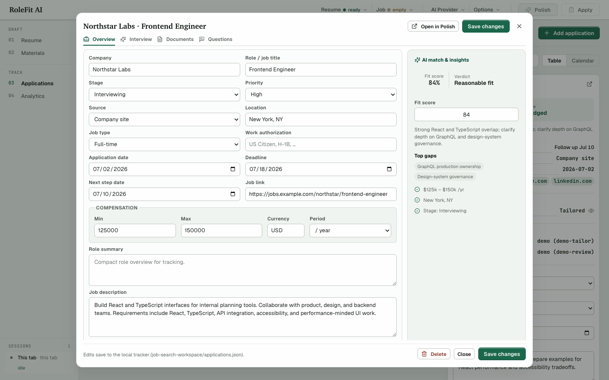

# RoleFit AI

A **companion-launched, browser-primary, local-first** resume tailoring
workbench backed by a loopback Node server. Import a job posting (paste it, or pull it straight from
the link), tailor your base resume from your workspace, score the draft against
the job description, and export to PDF or save a re-loadable `.resume` file —
without storing your personal data in a hosted app. The installed Electron
companion starts the local service, manages the five supported local
providers, and opens RoleFit in the default browser; it is not a second RoleFit
interface. Resume editing stays in the browser, while tracker and workspace
storage remain owned by the local server.

[Product site and companion downloads](https://rolefit.xinyiklin.com/)

> Built for an entry-level SDE job hunt: tight workflow loop, blunt recruiter-style audit before applying, and a local pipeline tracker so you never lose track of a role.



The on-disk **application tracker** — a sortable, paginated table with right-click quick actions, plus a calendar of submissions and follow-ups:

<table>
<tr>
<td width="50%"></td>
<td width="50%"></td>
</tr>
<tr>
<td width="50%"></td>
<td width="50%"></td>
</tr>
</table>

_Screenshots use fictitious demo workspace data and reflect the current browser UI._

The engine-painted page is the editor and source of truth: type directly in the
export layout, use its margin controls to add, remove, reorder, or scope
sections, and send review cards back to the exact field. The editor is its own
preview — it and the PDF export use the same layout engine, and a `.resume` file
saves the structured resume data so you can reload it later or move it between tabs.

## Highlights

- **Resume input** — ingest a `.txt`, `.md`, or `.csv` resume (or paste text) into the typeset editor as a one-time conversion into the structured model, or load a previously saved `.resume` file directly; paste extracted PDF text when the original is only available as PDF.
- **Job-link import** — paste a posting URL and pull the description in one click: Workday-aware through CXS JSON, Ashby-aware through its public posting API (including Handshake's branded wrapper), with Greenhouse-wrapper resolution and a generic HTML→text fallback for other boards. The posting is distilled before polishing — **AI-first** via the configured provider, with server-side grounding/sanitization checks and a deterministic parser that can preserve a local brief for inspection when AI fails. A failed AI Distill remains failed and cannot auto-launch Tailor or Review. The compact brief keeps role context, responsibilities, requirements, preferred qualifications, and technical/domain signals while dropping ATS/navigation/marketing/legal furniture. The link itself is kept only for pipeline tracking and is **never sent to the model**.
- **Paired browser extension (Chrome/Firefox)** — the unpacked extension can check whether a posting is already tracked and import it into a fresh RoleFit tab. On first use it sends a bounded local access request; approve that exact browser origin once in the companion. The extension does not estimate fit locally; score and verdict come from AI Review in the app. See [Browser extension](#browser-extension).
- **Explicit five-provider setup** — the companion can add **Claude Code CLI**, **Codex CLI**, **Antigravity CLI**, **OpenAI API**, and **Claude API**. CLI paths use their provider-owned account sessions and API paths use a locally encrypted key. The browser AI menu shows only providers the user explicitly added, keeps configured-but-unready providers visible with reconnect guidance, and never silently switches a stage to a paid provider.
- **AI-owned fit review** — the selected Review model judges the complete requirement set and returns the coverage table, base/tailored scores, verdict, explanation, gaps, and recommendation. RoleFit validates the response contract but does not recalculate or replace that judgment locally.
- **Strict recruiter review mode** — audit the current edited draft as-is, or audit the sanitized proposal produced moments earlier in **Both**, for a verdict (STRONG FIT / REASONABLE FIT / STRETCH / DON'T APPLY), AI fit scores, gap severity, targeted bullet rewrites, interview risk flags, ready / edits-pending / missing-evidence status, and a cover-letter angle.
- **One typeset editing surface** — direct text editing, inline emphasis, undo/redo, keyboard caret movement, structural add/remove/reorder controls, per-section Tailor/Include/Off scope, and review-field highlighting all operate on the exported page layout.
- **Ordered AI workflow** — Distill, Tailor, and Review share one reusable progress surface with exact step counts, specific failure reasons, Retry/Stop behavior, and later stages marked not run after a failure.
- **WYSIWYG editor + PDF export** — the editor *is* the preview: it and the exported PDF use the same shared Typeset layout engine, so visible line breaks and page flow match the export exactly. No external toolchain to install — typesetting and PDF generation run in the browser.
- **`.resume` save/load** — download the structured resume data as a `.resume` file (lossless JSON, formatting preserved) and reload it later, or keep it as a portable backup of your work.
- **Portable workspace backup + restore** — the companion's Workspace tab saves one versioned `.rolefit-backup` containing validated base resumes, resume history, tracker records, saved application PDFs, and mirrored allowlisted RoleFit preferences. Restore validates every checksum and domain file in a staging workspace before replacing the active saved workspace, then keeps the previous workspace as a local safety copy. The JSON backup is not encrypted and never contains provider keys, CLI sessions, arbitrary workspace files, or unsaved recovery drafts.
- **On-disk pipeline tracker** — a sortable, paginated applications table (right-click any row for quick actions: open details, change stage, in-app PDF preview of the saved resume, or delete) alongside a calendar view of submissions and upcoming follow-ups. Tracks status / source / company / role / follow-up date / notes / resume snapshot per application, and survives browser wipes.
- **Local-first personal workflow** — the browser app, server, paired extension bridge, and workspace files run on your own device. Source development uses the gitignored `job-search-workspace/`; an installed companion uses `app.getPath("userData")/workspace/`. Origin-scoped browser storage may contain recovery resume/job drafts plus user settings and context, but never API keys. The Electron companion encrypts supported API keys with the operating system through `safeStorage` and stores only encrypted bytes locally beneath its own `userData`; keys never enter browser storage, browser requests, status payloads, or logs. A companion-owned server receives decrypted keys only in memory through a private parent/child channel. AI-backed import, polish, cover-letter, and application-answer features still send the relevant job/resume text directly from the local server to the provider you choose; resume/job payloads do not cross Electron IPC.

## Stack

React 19 · TypeScript · Vite · Node.js (reusable `server/runtime.ts`) ·
Electron 43 provider companion · shared `@typeset/engine` / `@typeset/editor`
workspaces · custom CSS · `lucide-react` icons

No hosted RoleFit backend, database, or account system. Supported provider integrations: Claude Code CLI · Codex CLI · Antigravity CLI · OpenAI API · Claude API.

## Run

For the supported installed product flow, run the RoleFit companion and choose
**Open RoleFit**. It starts the loopback server and opens the Drafting Desk in
the default browser.

For source development from the repository root:

```bash
npm install
npm run dev:rolefit
```

Visit `http://localhost:5181`.

The standalone source command is a contributor path and cannot use the
companion-managed provider vault. The server binds to loopback by default.
`HOST=0.0.0.0` is an explicit, unauthenticated LAN-exposure override; never use
it on a public or untrusted network.

To run the supported companion development target:

```bash
npm run dev:rolefit:desktop
```

The browser remains the only RoleFit product UI. Electron starts or compatibly
reuses the same numeric-loopback server, renders only a compact local `file:`
setup window, and opens the selected local site in the system browser. The
default is `http://localhost:5181`; **Local site port** accepts an available
integer from 1 through 65535 and applies it through a clean companion restart.
`ROLEFIT_DESKTOP_PORT` is a locked per-launch override. Its typed
preload exposes fixed write-only API-key setup, provider removal/status,
external-terminal sign-in, install/sign-in-guide, and browser-open methods for
the closed five-provider catalog. The companion never renders the Drafting Desk,
duplicates product APIs, or receives resume/job payloads over Electron IPC. Its
local server owns workspace and tracker files. Changing the port also changes
the browser origin, so browser-local draft and preference storage is separate
on the new port. Packaged workspace files and provider configuration stay in
the same operating-system `userData` directory.
The browser extension remains fixed to the canonical port `5181` in this phase.

Distribution scaffolding can build native macOS arm64/x64 DMG and ZIP artifacts
and a Windows x64 Squirrel installer. Stable public releases fail closed unless
the native signing credentials are available. A separate
`rolefit-preview-vX.Y.Z-beta.N` workflow may publish checksum-covered unsigned
GitHub prereleases while those identities are unavailable: macOS receives only
an ad-hoc integrity signature and is not notarized, while the Windows installer
is not Authenticode-signed. Both platforms therefore show security warnings.
The current Windows PFX inputs are a compatibility seam, not a recommended way
to procure a new public-trust certificate; a new signing identity should use a
reviewed hardware-backed managed signer before the first Windows tag.
Auto-update, a custom protocol, database, RoleFit account, and sync are not
implemented. See the
[distribution and cloud architecture plan](docs/engineering/distribution-cloud-plan.md).

Use Node 24 on a matching native host for packaging:

```bash
npm run build:rolefit:desktop:package
npm run package:rolefit:desktop
npm run make:rolefit:desktop
npm run test:rolefit:desktop:packaged
```

## AI setup

Add providers in the Electron companion, then choose among those configured
providers and their models in the browser's top-bar AI menu. Its Distill,
Tailor, and Review sections stay expanded together; there is no per-section
collapse control:

- **Distill** — job-link, paste, and import distillation into a compact job brief.
- **Tailor** — evidence-grounded resume suggestions, cover letter, and application-answer drafting.
- **Review** — strict recruiter-style audit of the current edited draft.

Each stage has its own provider/model/effort settings; use **Copy from** in the
menu to sync one stage from another. The browser never renders or submits an
API-key field. The companion accepts OpenAI and Claude keys as write-only
values, encrypts them through Electron `safeStorage`, and never reveals a saved
key. Removing an API provider deletes its encrypted RoleFit credential;
removing a CLI only removes it from RoleFit and does not log the provider CLI
out globally.

A server started through the companion receives managed API credentials only
through its private in-memory process channel; it neither inherits those keys
nor loads the app-local `.env`. A standalone development server cannot receive
the vault; while one is being reused, stop it and reopen RoleFit through the
companion before adding, removing, or enabling providers. `.env` remains an
explicit server-side fallback for standalone headless/development use:

```bash
# pick one (or set multiple and switch in-app)
OPENAI_API_KEY=...
ANTHROPIC_API_KEY=...
```

To avoid configuring a separate metered API key, add an account-backed CLI
provider in the companion. Once added, each CLI row offers **Sign-in guide**,
which opens that provider's official installation and sign-in documentation in
your browser, and **Terminal ↗**, which launches the provider's own login
command in an external terminal. RoleFit runs no in-app login form and never
asks for a vendor username, password, MFA value, OAuth code, or recovery token;
signing in happens entirely through the provider's own CLI. Claude Code and
Codex expose a machine-readable auth status, so the companion can show
**Sign-in required** or **Ready** for them. Antigravity 1.1.x exposes no
non-interactive auth-status command, so an installed `agy` shows **Ready to
verify** with `authState` still `unknown`, not a false signed-in claim. The
first actual Antigravity provider request verifies the provider-owned session
and reports actionable guidance if that request fails authentication.

The CLIs sign in with their own commands — the same ones **Terminal ↗** runs:

```bash
# requires a current Claude Code installation and an account with CLI access
claude auth login --claudeai

# requires a current Codex CLI installation and an account with CLI access
codex login

# requires a current Antigravity CLI installation and Google account access
# first launch opens the supported sign-in flow
agy
```

When a supported CLI executable is missing, the companion shows **Not
installed**, links to that provider's official installation instructions, and
offers **Check again**; it never silently runs a package manager or elevated
installer. The browser can report that its local provider registry is
unavailable, but a normal web page cannot reliably distinguish a closed
companion from one that is not installed. The public product/download page does
not attempt that detection: the companion is required, and the page shows the
three supported platform choices with a safe GitHub Releases fallback. It
prefers a complete signed release and may offer a complete unsigned prerelease
only with an explicit warning beside the download controls.

The local server shells out to configured, ready CLIs for AI-backed import,
polish, cover-letter, and application-answer requests — no API key required.
The CLI auth/session remains provider-owned and tied to the device.
Antigravity 1.1.x requires its non-interactive prompt in the local process
argument list; unlike the Claude and Codex wrappers, that path cannot keep
resume/job text exclusively on stdin while the subprocess is running.

> **Provider support:** RoleFit intentionally exposes only the three subscription CLIs plus the native OpenAI Responses and Claude Messages APIs. Other adapters were removed until they have current contracts and live verification. CLI entitlements and API model access still depend on the signed-in account.

When **Distill with AI** is off, deterministic job extraction is an intentional
local-only success path. When AI Distill was requested but fails, RoleFit may
load the deterministic brief for inspection while leaving Distill failed and
blocking Tailor/Review. Tailor, Review, Cover Letter, and application-answer
generation fail plainly; no local draft, score, or verdict silently stands in.

## Browser extension

The unpacked Chrome/Firefox extension uses an explicit first-use approval in
the local companion. On a job page, open the popup; if the browser is not yet
approved, it sends a bounded local request. Open the companion and select
**Approve** under **Browser extension**, then reopen the popup. That exact
origin remains paired until removed. Once approved, the popup brings RoleFit
import and duplicate checking to the job board. On any posting, click the
**RoleFit AI** toolbar icon to see:

- whether you've **already tracked or applied** to that posting. A shared ATS or
  requisition id is definitive; a normalized URL is exact unless explicit ids
  conflict. Different explicit ids default to separate postings; only an
  exceptionally strong company/title/location/content match raises a review-only
  warning in case an id was entered incorrectly. When neither side has an id,
  RoleFit requires substantial company/title/location-aligned description and
  phrase overlap. Tracker review can merge a group or mark it **Not duplicates**
  so that pair stays out of future duplicate review, and
- a one-click **Import to RoleFit AI** that opens a fresh independent RoleFit tab, lets the server prepare the raw page text, then has that tab distill it with its own Distill provider before loading the Job field. **Polish automatically after import** can run polish as soon as the brief and your base resume are ready. Turning **Distill with AI** off skips the provider call, imports the prepared local text, and retains deterministic tracking extraction.

It is Manifest V3 and sends requests **only** to your local server at
`http://localhost:5181`. The manifest grants `http://localhost/*`, which covers
HTTP on the `localhost` hostname across ports because Chrome and Firefox host
match patterns cannot safely pin one localhost port. The popup itself remains
fixed to port `5181`; a custom companion port supports direct browser use but
not extension imports. The routes it calls require the exact installed popup
Origin approved in the companion and reflect only that non-wildcard Origin.
Unapproved callers may only enqueue a short-lived pairing request; they cannot
analyze or import a posting. The
inbox the app reads is same-origin and CSRF-guarded. The server-side import step prepares the captured posting text
(for example, resolving a fuller board description when possible); the
receiving tab then runs the app's Distill stage with its selected CLI or native
API provider, or skips that provider call when **Distill with AI** is off.
Imports carry a short local claim token so the newly-opened tab receives its own
posting, while other open tabs continue their current jobs; the app also shows
a small read-only "other sessions" card when another tab is active. The
extension never reads the base resume or produces a fit judgment.

Load the unpacked extension from `apps/role-fit-ai/extension/`:

- **Chrome / Edge** — open `chrome://extensions`, enable **Developer mode**, click **Load unpacked**, and select the `extension/` folder.
- **Firefox** — open `about:debugging#/runtime/this-firefox`, click **Load Temporary Add-on…**, and select `extension/manifest.json`.

Start the companion on port `5181`, open the extension on a job page, approve
the pending request in the companion, and reopen the popup. See
[`extension/README.md`](extension/README.md) for the complete flow.

## Install and local data

The macOS DMG lets the user place `RoleFit AI.app` where they choose, normally
`/Applications`. The Windows Squirrel installer is per-user and normally installs beneath
`%LOCALAPPDATA%\RoleFitLocalCompanion\app-<version>\`. Installation files and
personal data are separate. The public application name is **RoleFit AI**;
Windows upgrade and cross-version data directories retain their original
internal identity so an update does not create a second installation or lose
saved settings.

The installed companion uses Electron's platform `userData` directory:

- macOS: `~/Library/Application Support/RoleFit Local Companion/`
- Windows: `%APPDATA%\RoleFit Local Companion\`

Under that directory, `workspace/` contains resumes, tracker data, and saved
application artifacts; `provider-vault/providers.json` contains only provider
configuration plus operating-system-encrypted API-key bytes; and
`desktop-settings/settings.json` contains the local-site port. There is no
custom workspace-location picker in 0.1.0. `ROLEFIT_WORKSPACE_DIR` is an
explicit source-development/test override, not a supported installed-app
setting.

Browser recovery is separate from the on-disk workspace. The active localhost
origin may store a serialized recovery resume, optional raw job text, AI usage,
stage settings, honest context, custom instructions, and work-authorization
preferences in browser storage. It never stores API keys. Changing the local
port creates a different browser origin. RoleFit mirrors the allowlisted
preferences into the workspace's `browser-preferences.json`, and a fresh origin
with no saved RoleFit preferences adopts that mirror on load, so settings
survive a port change; unsaved recovery drafts remain origin-scoped and do not
move.

For a portable resume-only backup, download a `.resume` file. For the saved
RoleFit workspace, open the companion's **Workspace** tab and choose **Back
up workspace**. The resulting `.rolefit-backup` is unencrypted JSON containing
app-managed base resumes, resume history, tracker data, saved application
PDFs, and the mirrored allowlisted RoleFit preferences. It excludes arbitrary
files in the workspace, unsaved recovery drafts, provider configuration/API
keys, CLI sessions, and companion port settings. Close RoleFit browser tabs
before choosing **Restore backup** — the server refuses to restore while live
tabs are detected. RoleFit validates the complete backup in a staging
directory, moves the current saved workspace to a timestamped sibling safety
directory, and installs the restored workspace; the browser adopts the
restored preferences and clears superseded recovery drafts the next time it
loads. Add providers again on a new device. Before uninstalling, make the
backup you want. To erase RoleFit's retained local data, remove the
separate `userData` directory and clear site data in your browser for every
RoleFit loopback origin you used, including each configured port under
`http://127.0.0.1:<port>` or `http://localhost:<port>`.

### Workspace contents

The local server creates one private workspace. Its default path depends on how
RoleFit starts:

- Installed companion: the platform `userData` path above plus `workspace/`
- Source development: `apps/role-fit-ai/job-search-workspace/`

The workspace contains:

- `base-resume.resume` (or `.txt`, `.md`, `.csv`) — auto-loaded on startup
- `applications.json` — the pipeline tracker's on-disk store
- `applications/<id>/resume.pdf` — saved tailored PDFs attached to tracker rows
- `.trash/` — recoverable base-resume history
- `browser-preferences.json` — mirrored allowlisted RoleFit preferences
- Anything else you drop in there (left out of portable backups)

The source-development folder is gitignored except its README. Personal
resumes, `.resume`/PDF files, and root-level resume artifacts are also
gitignored as a privacy guard.

## Project layout

```
server.ts                       # thin local web-server launcher
server/
  runtime.ts                    # reusable HTTP/Vite lifecycle + route composition
  ai/                            # /api/polish + /api/distill: routes, providers,
                                 #   clients, prompts, sanitize, grounding, eligibilityLexicon,
                                 #   json, errors, coverLetter + applicationAnswers
  ai-cli/index.ts               # Claude Code / Codex / Antigravity CLI shell-out
  applications/                  # pipeline tracker storage (index) + HTTP routes
  base64.ts                     # base64 <-> Buffer helpers (base-resume / PDF artifact I/O)
  extension/                     # browser-extension API routes, duplicate status, inbox handoff
  http.ts                       # JSON/body/fetch utilities
  jobImport.ts                  # /api/import-job: ATS resolvers (Workday/Ashby/Greenhouse/LinkedIn → text)
  network.ts                    # job-link fetch + SSRF guards
  starter.resume                # bundled starter resume seeded when the workspace has no base resume
  workspace.ts                  # base-resume workspace storage + .trash version history
src/
  App.tsx                        # state + handlers + composition
  config/aiOptions.ts            # provider/model/reasoning options
  hooks/                          # applications, workspace resume, apply flow, polish pipeline,
                                  #   job intake, per-tab autosave/presence, resume export/analysis, AI settings
  lib/                           # downloads, job extraction/distilling, AI text adapters + review-target mapping
  sections/                      # masthead, nav menus, tabs, workflow progress, saved-PDF preview, review rail
  sections/editor/               # RoleFit-only AI-scope + review-target overlay
  sections/tabs/                 # Resume / Materials / Applications / Analytics
  resume/                        # RoleFit analysis/types/keywords/rewrite/diff (no fit scoring)
  resumeEngine.ts                # compatibility barrel over focused RoleFit resume helpers
  typeset/__evals__/             # RoleFit integration + migration parity checks for the shared engine
  styles/                        # per-surface CSS + shared tokens
../../packages/engine/           # canonical resume model, strict `.resume` codec, layout, DOM/print, PDF, fonts
../../packages/editor/           # shared direct editor, history/style hooks, formatting toolbar, editor CSS
extension/                       # Chrome/Firefox MV3 popup (import + duplicate/applied status)
desktop/                         # required product launcher, provider manager, vault + trust boundary
landing/                         # isolated public product/download page
dist-electron/                   # generated companion CommonJS output; gitignored
docs/engineering/                # RoleFit contributor notes (server/AI, UI, testing)
job-search-workspace/            # source-development workspace; gitignored except README
```

## Monorepo and scripts

RoleFit consumes private workspace packages `@typeset/engine` and
`@typeset/editor`; the standalone Typeset app consumes the same packages.
Shared document behavior belongs in those packages, while job/AI/tracker
behavior stays in RoleFit. See the root
[architecture guide](../../docs/architecture.md).

Run from the repository root:

```bash
npm run dev:rolefit
npm run dev:rolefit:desktop      # supported companion flow
npm run build:rolefit:landing    # isolated Pages artifact
npm run build:rolefit
npm run build:rolefit:desktop
npm run test:rolefit:desktop     # explicit companion integration smoke
npm run check --workspace apps/role-fit-ai
npm run preview --workspace apps/role-fit-ai
```

## License

[MIT](../../LICENSE) © Xinyi Lin
