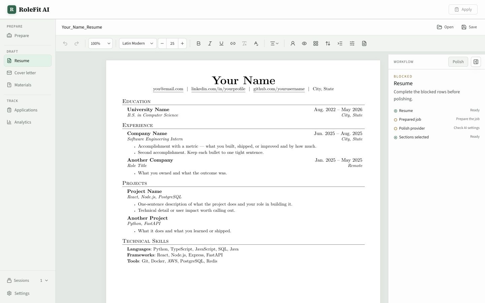
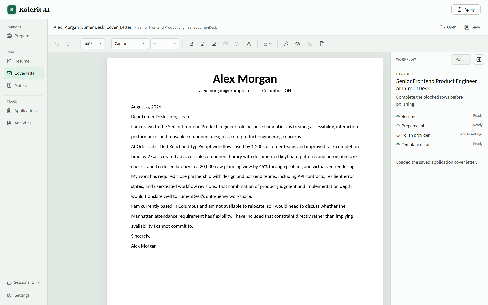
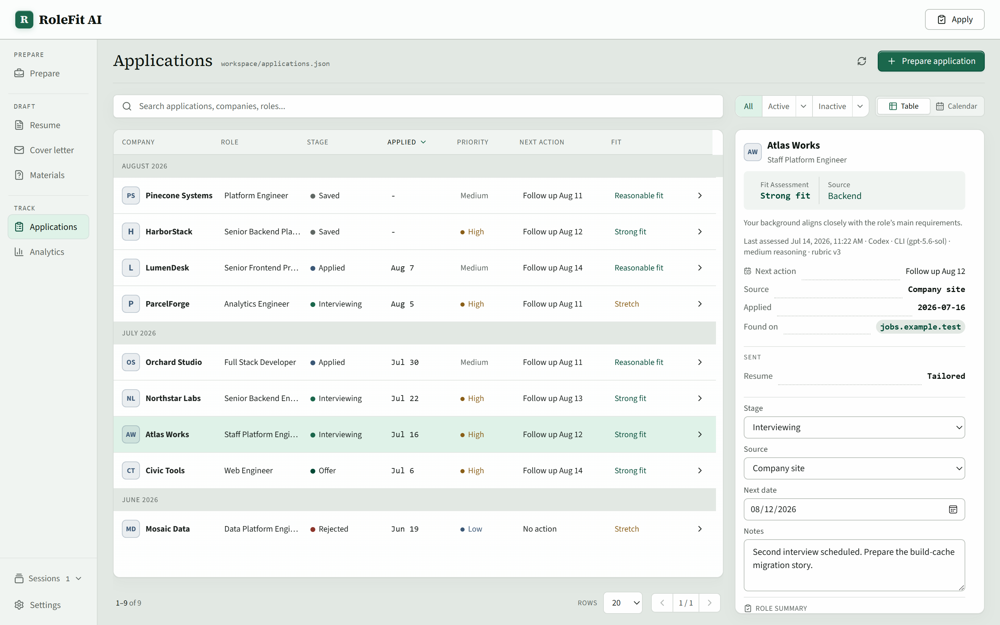
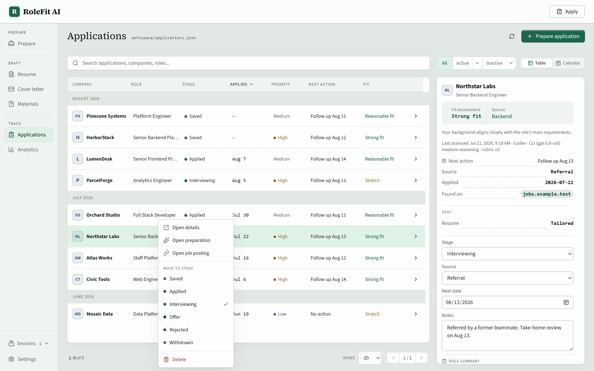
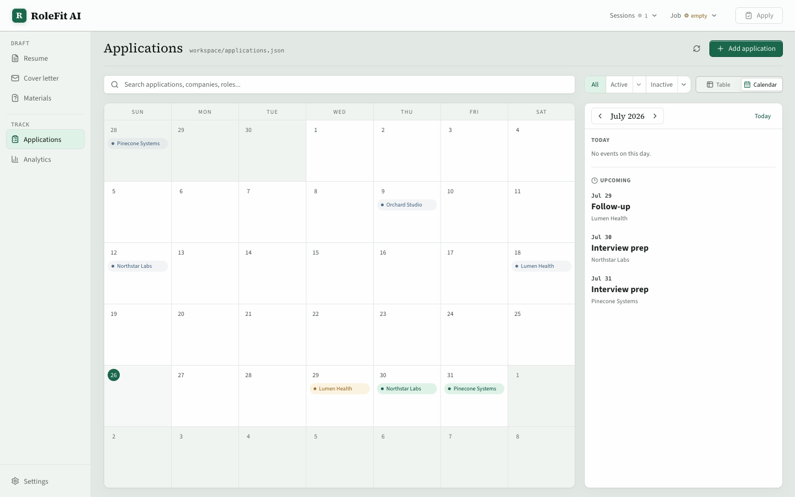
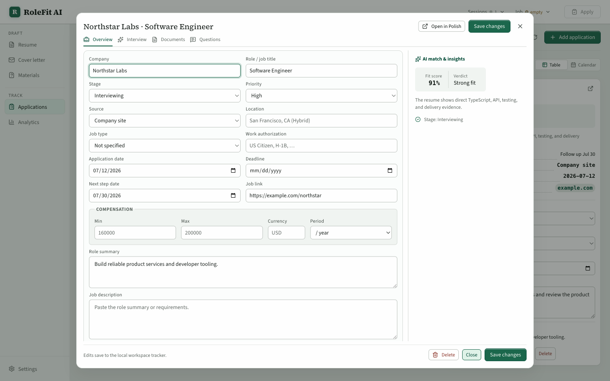

# RoleFit AI

RoleFit AI is a local-first workspace for preparing job applications. Import a
posting from the browser extension, a URL, or pasted text; choose a resume and
cover-letter variant; create a grounded resume proposal; review document
proposals; export the final files; and save the application record.

The desktop companion starts the loopback Node server, manages the five
supported providers, pairs the browser extension, and backs up the saved
workspace. Editing happens in the browser, while documents, tracker records,
and provider settings stay on this computer. RoleFit has no hosted account or
application-data service.

[Product site and companion downloads](https://rolefit.xinyiklin.com/)

Current desktop source version: **0.6.0** (preview).

The default workflow is Prepare → Assess fit → Polish → Apply. Reassess fit at
any time after preparation without repeating Job analysis.



The **cover-letter editor** keeps the source letter, job evidence, named
variants, proposal review, and final export page together:



The on-disk **application tracker** includes a sortable, paginated table,
right-click actions, and a calendar for submissions and follow-ups:

<table>
<tr>
<td width="50%"></td>
<td width="50%"></td>
</tr>
<tr>
<td width="50%"></td>
<td width="50%"></td>
</tr>
</table>

_Screenshots use fictitious demo workspace data and reflect the current browser UI._

The engine-painted page is the editor and source of truth: type directly in the
export layout, use its margin controls to add, remove, reorder, or scope
sections, and send review cards back to the exact field. Each editor is its own
preview. Resume and cover-letter pages share the deterministic layout engine
with their PDF exports, while strict `.resume` and `.cover` files preserve the
editable documents.

## Highlights

- **Resume input** — ingest a `.txt`, `.md`, or `.csv` resume (or paste text) into the typeset editor as a one-time conversion into the structured model, or load a previously saved `.resume` file directly; paste extracted PDF text when the original is only available as PDF.
- **Cover-letter workflow** — open a `.cover`, `.txt`, or `.md` letter (or your
  own base variant full of bracketed prompts) and press **Polish** once. RoleFit
  resolves the date, your name, the role, the company, the greeting, and the
  sign-off itself, and the model picks which of your experiences and personal
  notes this posting actually warrants. Bracketed text is treated as an
  instruction to the writer, never as something you wrote about yourself.
  Grounding and placeholder checks run on the server, then the finished letter
  appears beside the unchanged editor as a whole-document proposal, opening on a
  **Changes** view that marks what accepting would rewrite (the full letter is one
  click away). **Accept
  proposal** applies it atomically and enables **Restore previous** until the
  next edit; **Discard proposal** performs no document mutation. Validation blockers
  identify the rejected claim and whether to add evidence, edit the source, or
  retry without exposing rejected provider output or internal evidence ids. An
  unfinished Guidance prompt is ignored until completed, and worded durations
  such as “three years” are grounded like `3 years`. If the workflow rail is
  collapsed, its icon shows the bounded issue count. You
  are only asked something when a fact cannot
  be resolved at all — a missing company or role, or a template that names a
  private detail such as a referral. Unsaved edits are kept in a
  recoverable draft and the letter is named like the resume
  (`Name_Company_Cover_Letter`), so both editors behave the same way. Selecting
  a saved cover-letter variant changes its contents without replacing that
  application output name, and both editor headers use the same
  `Role at Company` sublabel.
  A new letter starts in Carlito at 11 pt with double line spacing, 8 pt after
  each paragraph, an additional 8 pt before its date, 0.5 inch top/bottom
  margins, and 0.75 inch side margins — Calibri's metrics, the shape business
  correspondence is usually written in — and any bundled family is a menu away.
- **One Prepare workspace** — Prepare is the first/default studio page and the
  only place a job enters the current session. It leads PREPARE / DRAFT / TRACK
  navigation while the masthead carries only the RoleFit identity and Apply.
  The bottom studio rail places read-only Sessions immediately above Settings,
  outside the output tablist; its label/count condenses to an icon plus compact
  count/working state when the rail collapses, and its popover opens rightward
  within the viewport. The paired extension is the primary path; URL fetch and
  pasted text remain available there as deliberate one-at-a-time fallbacks.
  Before preparation, the focused
  Source panel shows only the selected URL or pasted-text method. Afterward it
  collapses above the complete editable job brief—tracked job facts, company
  context, responsibilities, required and preferred qualifications, technical
  keywords, seniority and domain signals, benefits, and any extraction gaps—while
  the Application rail keeps Resume, Cover Letter, Fit Assessment, readiness, and
  Apply together. Fit Assessment is a reusable compact advisory for the selected resume,
  with four categorical verdicts, bounded matches and gaps, and a separate
  eligibility state. Rubric v3 prioritizes decision-critical responsibilities
  and core qualifications, preserves explicit evidence-source boundaries, ignores
  logistics or application-form noise when judging fit, and self-checks every
  evidence excerpt before the server's exact-anchor boundary.
  Its behavior and verdict meanings live in the
  [Fit Assessment user contract](PRODUCT.md#fit-assessment-user-contract); provider,
  grounding, reassessment, and provenance details live in the
  [technical contract](server/ai/README.md#fit-assessment-technical-contract).
  Each material has an **Include** toggle and its
  own named variant selector. Resume starts included and Cover Letter starts excluded;
  included material must be ready before Apply, while either or both can be
  excluded. The captured posting remains unchanged behind **View** and
  **Prepare again**; Apply stores the complete corrected brief, while resume
  polishing continues to use the benefits-excluded projection.
- **Evidence-based variant recommendation** — when multiple saved variants
  exist, Prepare compares the actual strict `.resume` and `.cover` contents with
  weighted role, requirement, responsibility, and technology signals from the
  prepared job. A meaningful unique winner is selected automatically for either
  document while its editor is clean and not application-owned. A tie or
  incomplete comparison keeps the current choice and makes no recommendation;
  unsaved work is never replaced. Resume candidate bytes and option metadata
  are resolved from one snapshot, with one retry if the saved option set changes
  or any saved candidate is overwritten mid-read—even under the same filename;
  a failed load keeps the current resume without advertising an unloaded winner.
  Neither document persists parallel variant metadata.
- **Job-link preparation** — paste a posting URL on Prepare and fetch the
  description: Workday-aware through CXS JSON, Ashby-aware through
  its public posting API (including Handshake's branded wrapper), with
  Greenhouse-wrapper resolution and a generic HTML→text fallback for other
  boards. The configured Job analysis provider runs before the server's grounding
  and sanitization checks.
  A deterministic parser publishes a usable local brief immediately. Job analysis
  can improve it, but provider failure leaves the local fields editable and does
  not block manual Polish. Fit Assessment has its own provider/model/effort
  setting. When that configuration exactly matches Job analysis, the same
  provider dispatch returns it as an independent optional subsection; otherwise
  the prepared brief commits before a separate assessment-only request. An
  invalid fit cannot invalidate valid job fields. The compact
  job brief keeps role context, responsibilities,
  requirements, preferred qualifications, and technical/domain signals while
  dropping ATS/navigation/marketing/legal furniture. Prepare separately keeps
  extracted benefits visible and editable without widening
  the resume-tailoring prompt. The link itself is kept only for pipeline
  tracking and is **never sent to the model**.
- **Paired browser extension (Chrome/Firefox)** — the unpacked extension can
  check whether a posting is already tracked and open it on Prepare in a fresh
  RoleFit tab. On first use it sends a bounded local access request; approve
  that exact browser origin once in the companion. The extension does not
  estimate fit locally; Fit Assessment runs in Prepare against the selected resume. See
  [Browser extension](#browser-extension).
- **Explicit five-provider setup** — the companion can add **Claude Code CLI**, **Codex CLI**, **Antigravity CLI**, **OpenAI API**, and **Claude API**. CLI paths use their provider-owned account sessions and API paths use a locally encrypted key. Settings > AI stages shows only providers the user explicitly added, keeps configured-but-unready providers visible with reconnect guidance, and never silently switches a stage to a paid provider.
- **One-pass Resume Polish** — one provider operation proposes grounded edits
  through flat target IDs. Skills category labels are locked; actual skill lists
  remain editable. The server drops malformed, unknown, unchanged, swapped, or
  unsupported edits independently, so a bad optional note or one bad edit does
  not discard safe siblings. Only bullets and Skills lists are mutable;
  role, employer, subtitle, date, identity, contact, and education fields remain
  read-only evidence. Large resumes prioritize material, job-relevant
  fields inside the prompt budget, validate replies only against fields actually
  sent, and show how many editable fields were outside that pass. Any upward
  ownership rewrite is withheld unless evidence at that level is semantically
  tied to the target's own work; leadership in an unrelated sibling bullet or
  broad context cannot authorize it. The source
  resume stays unchanged until the user applies all or accepts an individual edit.
- **Optional Fit Assessment automation** — Fit Assessment defaults on, while Resume
  and Cover Letter automatic Polish remain separate, default-off decisions.
  Manual Polish stays available for every outcome; see the
  [user contract](PRODUCT.md#fit-assessment-user-contract) for thresholds,
  eligibility, staleness, and Retry behavior.
- **One typeset editing surface** — direct text editing, inline emphasis, undo/redo, keyboard caret movement, structural add/remove/reorder controls, per-section Polish/Include/Off scope, and proposal-field highlighting all operate on the exported page layout.
- **One document workbench rail** — Resume and Cover Letter share the same
  always-present lifecycle hierarchy, readiness order, failure placement,
  collapsible desktop rail, and narrow accordion behavior while keeping their
  own workflow state. Both spell the run **Polish**; Resume creates one proposal
  from Resume or Prepare, while Cover Letter stages an explicit whole-document
  proposal. Polish sits beside
  the rail's disclosure control in both states, so collapsing moves the pair to
  the document's edge rather than relocating the action. Each
  document remembers its own expanded or collapsed preference, and hidden
  workflow state remains intact when reopened.
- **Word-processor editing behavior** — Resume Tab/Shift+Tab moves between
  complete header and section fields (including wrapped fields); the cover
  letter uses that navigation in its optional header, and its body paragraphs
  indent by a half inch on Tab — first the opening line, then the whole
  paragraph, or the whole paragraph at once when it is all selected — and
  Shift+Tab takes those indents back. Same-editor copy/paste keeps supported inline font and
  formatting runs, mixed families and sizes share a typographic baseline, and
  Ctrl/Cmd +/-/0 controls page zoom in both document layouts. Continuous
  typing and held Backspace/Delete bursts undo as groups; direction changes,
  caret or field moves, selections, formatting, structural edits, and pauses
  start a new group.
- **Truthful AI workflow** — Prepare shows its local brief while Job analysis and
  optional Fit Assessment settle independently. Resume Polish reports Proposal,
  No changes, and Withheld as different outcomes, retains specific failure and
  Stop behavior, and never presents an all-discarded response as a ready proposal.
  Job analysis, Resume Polish, Cover letter, and Application answers each use an
  independently named progress card with direct Stop control while its request runs.
- **Internal Polish audit** — Resume and Cover Letter Polish silently re-check
  evidence, claims, identifiers, and output shape before returning a proposal.
  The configured reasoning effort controls the provider reasoning and audit
  breadth; no separate check result is persisted or shown.
- **WYSIWYG editor + PDF export** — the editor _is_ the preview: it and the exported PDF use the same shared Typeset layout engine, so visible line breaks and page flow match the export exactly. No external toolchain to install — typesetting and PDF generation run in the browser.
- **`.resume` save/load** — download strict schema-v1 structured resume data,
  including explicit hidden/visible/absent header state, as a `.resume` file
  (lossless JSON, formatting preserved) and reload it later.
- **`.cover` save/load** — download ordered cover-letter paragraphs plus their
  explicit optional header and print-style contract as a strict schema-v1 `.cover`
  file. `.resume` remains
  resume-only; `.rolefit-backup` is the separate allowlisted saved-workspace format.
- **Named variants for both documents** — resumes and cover letters both live in
  `workspace/resumes/<variant>.resume` and
  `workspace/cover-letters/<variant>.cover`, each with
  named variants (a Backend SDE letter beside a Growth one) and version history.
  Every save archives the version it replaces, so nothing is overwritten
  destructively. Both editors use the same Open and Save menus: Open lists the
  starter, a blank, a file picker, and everything already saved; Save updates the
  active copy, adds a variant, or takes a `.resume`/`.cover`/`.txt`/PDF away.
  Resume always keeps a real editable page mounted: when no saved source exists,
  it starts as a clean blank `.resume` document, while PDF, Polish, and Apply
  remain unavailable until the document has meaningful content.
  Each editor automatically reopens its last active saved variant on that
  browser origin, falling back to Default when no remembered variant remains.
  Recovery includes title-only and style-only cover-letter edits. Drafts are
  tab-owned: adopting a restored workspace clears this tab's stale draft and
  confirmed-dead orphans, preserves drafts owned by live sibling tabs, and
  notifies those siblings that the saved workspace changed.
- **Portable workspace backup + restore** — the companion's Workspace section saves one versioned `.rolefit-backup` containing validated base resumes, resume history, tracker records, each application's saved `.resume`, `.cover`, or PDF document, PDF attachments, and canonical allowlisted workspace preferences. Restore validates every checksum and domain file in a staging workspace before replacing the active saved workspace, then keeps the previous workspace as a local safety copy. The JSON backup is not encrypted and never contains standalone cover-letter variants, provider keys, CLI sessions, arbitrary workspace files, or unsaved recovery drafts.
- **On-disk pipeline tracker** — a sortable, paginated applications table (right-click any row for quick actions: open details, change stage, preview the saved resume as a PDF, or delete) alongside a calendar view of submissions and upcoming follow-ups. Tracks status / source / company / role / follow-up date / notes, compact Fit Assessment snapshots, plus saved resume, cover letter, and additional PDF documents per application. It does not retain numeric fit scores or full provider review payloads. Fit Assessment remains available for explicit sorting but never derives High/Low priority; the user's selection wins, Interviewing/Offer may derive High, and other records default Medium. A document is shown as saved only when its strict `.resume`/`.cover` source or explicit PDF exists; tracker text is never a reloadable document or an artifact claim.
  **Open preparation** restores a stored application's validated posting and
  available strict documents into the session, keeps the dirty-document
  replacement confirmation, and lands on Prepare. Apply saves only the
  materials included for that action; excluding a document on a later re-Apply
  leaves any previously saved artifact intact rather than deleting or
  replacing it. Applying with both material cards excluded still records the
  prepared job. The Applications page's new-work action also returns to
  Prepare; its detail modal edits committed records instead of duplicating job
  intake.
- **Local-first personal workflow** — the browser app, server, paired extension bridge, and workspace files run on your own device. Source development uses the gitignored `workspace/`; an installed companion uses `app.getPath("userData")/workspace/`. Origin-scoped browser storage may contain recovery resume/job drafts and a fail-open cache of allowlisted preferences, but canonical stage, candidate, and selected-resume preferences live in the owner-only workspace; neither location stores API keys. The Electron companion encrypts supported API keys with the operating system through `safeStorage` and stores only encrypted bytes locally beneath its own `userData`; keys never enter browser storage, browser requests, status payloads, or logs. A companion-owned server receives decrypted keys only in memory through a private parent/child channel. AI-backed job preparation, resume tailoring, cover-letter, and application-answer features still send the relevant job/resume text directly from the local server to the provider you choose; resume/job payloads do not cross Electron IPC.

## Stack

React 19 · TypeScript · Vite · Node.js (reusable `server/runtime.ts`) ·
Electron 43 desktop companion · shared `@typeset/engine` / `@typeset/editor`
workspaces · custom CSS · `lucide-react` icons

No hosted RoleFit backend, database, or account system. Supported provider integrations: Claude Code CLI · Codex CLI · Antigravity CLI · OpenAI API · Claude API.

## Run

For the supported installed product flow, run the RoleFit companion and choose
**Open RoleFit**. It starts the loopback server and opens the Drafting Desk in
the default browser.

For source development from the repository root:

```bash
npm install
npm run dev:rolefit
```

Visit `http://localhost:5181`.

The standalone source command is a contributor path and cannot use the
companion-managed provider vault. The server binds to loopback by default.
`HOST=0.0.0.0` is an explicit, unauthenticated LAN-exposure override; never use
it on a public or untrusted network.

To run the supported companion development target:

```bash
npm run dev:rolefit:desktop
```

The browser remains the only RoleFit product UI. Electron starts or compatibly
reuses the same numeric-loopback server, renders only a compact local `file:`
setup window, and opens the selected local site in the system browser. The
default is `http://localhost:5181`; **Local site port** accepts an available
integer from 1 through 65535 and applies it through a clean companion restart.
`ROLEFIT_DESKTOP_PORT` is a locked per-launch override. Its typed
preload exposes fixed write-only API-key setup, provider removal/status,
external-terminal sign-in, install/sign-in-guide, and browser-open methods for
the closed five-provider catalog. The companion never renders the Drafting Desk,
duplicates product APIs, or receives resume/job payloads over Electron IPC. Its
local server owns workspace and tracker files. Changing the port also changes
the browser origin, so browser-local draft and preference storage is separate
on the new port. Packaged workspace files and provider configuration stay in
the same operating-system `userData` directory.
After resolving the active server, the companion writes that port into the
materialized extension's `runtime-config.js` as a validated first-install seed.
The extension's saved browser setting remains authoritative. The companion's
Browser extension section shows and copies the active numeric port; after an app
port change, save that value in the popup's **Settings** view. The popup
reconnects immediately without an extension reload.

If a compatible RoleFit server already uses the selected port, its versioned
health response identifies it as a standalone development server or a service
launched by another companion session. The dialog names that state and offers
to use it, **Stop development server** or **Restart RoleFit service** with one
graceful `SIGTERM` on macOS/Linux, or **Use another port**. Alternate-port
selection scans nearby ports and persists the first available choice. A service
that does not stop within five seconds is never force-killed. Windows offers
the non-termination choices because it cannot provide the same graceful
signal. If the listener does not identify itself as compatible RoleFit, the
companion offers only another port or Quit and never signals that process.

Distribution scaffolding can build native macOS arm64/x64 DMG and ZIP artifacts
and a Windows x64 Squirrel installer. Stable public releases fail closed unless
the native signing credentials are available. A separate
`rolefit-preview-vX.Y.Z-beta.N` workflow may publish checksum-covered unsigned
GitHub prereleases while those identities are unavailable: macOS receives only
an ad-hoc integrity signature and is not notarized, while the Windows installer
is not Authenticode-signed. Both platforms therefore show security warnings.
The current Windows PFX inputs are a compatibility seam, not a recommended way
to procure a new public-trust certificate; a new signing identity should use a
reviewed hardware-backed managed signer before the first Windows tag.
Auto-update, a custom protocol, database, RoleFit account, and sync are not
implemented. See the
[distribution and cloud architecture plan](docs/engineering/distribution-cloud-plan.md).

Use Node 24 on a matching native host for packaging:

```bash
npm run build:rolefit:desktop:package
npm run package:rolefit:desktop
npm run make:rolefit:desktop
npm run test:rolefit:desktop:packaged
```

## AI setup

Add providers in the Electron companion, then choose among those configured
providers and their models in **Settings > AI stages**, opened from the foot of
the studio tab rail. Every stage section stays expanded together; there is no
per-section collapse control:

- **Job analysis** — structures the captured posting into the editable job brief.
- **Fit Assessment** — assesses the selected resume and About you evidence
  against the captured posting.
- **Resume Polish** — one evidence-grounded proposal request over selected fields.
- **Cover letter** — creates one grounded whole-letter proposal for you to
  accept or discard.
- **Application questions** — drafts grounded responses to an application's
  free-text questions.

Each stage has its own provider/model/effort settings. Resume Polish, Cover
letter, and Application questions expose an optional instruction override;
Job analysis and Fit Assessment keep fixed analysis contracts and do not.
Use **Copy settings** to sync one stage from another. The browser never renders or submits an
API-key field. The companion accepts OpenAI and Claude keys as write-only
values, encrypts them through Electron `safeStorage`, and never reveals a saved
key. Removing an API provider deletes its encrypted RoleFit credential;
removing a CLI only removes it from RoleFit and does not log the provider CLI
out globally.

A server started through the companion receives managed API credentials only
through its private in-memory process channel; it neither inherits those keys
nor loads the app-local `.env`. A standalone development server cannot receive
the vault; while one is being reused, stop it and reopen RoleFit through the
companion before adding, removing, or enabling providers. `.env` remains an
explicit server-side fallback for standalone headless/development use:

```bash
# pick one (or set multiple and switch in-app)
OPENAI_API_KEY=...
ANTHROPIC_API_KEY=...
```

To avoid configuring a separate metered API key, add an account-backed CLI
provider in the companion. A signed-out CLI row offers one consistent **Sign
in** action, which launches the provider's own login command in an external
terminal. A missing CLI offers its official **Install guide**. RoleFit runs no
in-app login form and never
asks for a vendor username, password, MFA value, OAuth code, or recovery token;
signing in happens entirely through the provider's own CLI. Claude Code and
Codex expose a machine-readable auth status, so the companion can show
**Sign-in required**, **Signed in**, or **Ready** for them. Antigravity 1.1.x exposes no
non-interactive auth-status command, so an installed `agy` shows **Ready to
verify** with `authState` still `unknown`, not a false signed-in claim. The
first actual Antigravity provider request verifies the provider-owned session
and reports actionable guidance if that request fails authentication.

The CLIs sign in with their own commands, the same ones the companion's **Sign
in** action runs:

```bash
# requires a current Claude Code installation and an account with CLI access
claude auth login --claudeai

# requires a current Codex CLI installation and an account with CLI access
codex login

# requires a current Antigravity CLI installation and Google account access
# first launch opens the supported sign-in flow
agy
```

When a supported CLI executable is missing, the companion shows **Not
installed**, links to that provider's official installation instructions, and
offers **Check again**; it never silently runs a package manager or elevated
installer. The browser can report that its local provider registry is
unavailable, but a normal web page cannot reliably distinguish a closed
companion from one that is not installed. The public product/download page does
not attempt that detection: the companion is required, and the page shows the
three supported platform choices with a safe GitHub Releases fallback. It
prefers a complete signed release and may offer a complete unsigned prerelease
only with an explicit warning beside the download controls.

The local server shells out to configured, ready CLIs for AI-backed job
preparation, resume tailoring, cover-letter, and application-answer requests —
no API key required.
The CLI auth/session remains provider-owned and tied to the device.
Antigravity 1.1.x requires its non-interactive prompt in the local process
argument list; unlike the Claude and Codex wrappers, that path cannot keep
resume/job text exclusively on stdin while the subprocess is running. RoleFit
uses the stable model slugs printed by current `agy models`; older saved display
names migrate without losing the selected model.

> **Provider support:** RoleFit intentionally exposes only the three subscription CLIs plus the native OpenAI Responses and Claude Messages APIs. Other adapters were removed until they have current contracts and live verification. CLI entitlements and API model access still depend on the signed-in account.

URL, pasted-text, and extension intake request AI-backed Job analysis. RoleFit
publishes the deterministic brief first; if Job analysis or Fit Assessment fails,
that local brief remains editable and manual Polish stays available. Resume
Polish, Cover Letter,
and application-answer generation fail plainly; no local draft, score, or
verdict silently stands in.

## Browser extension

The unpacked Chrome/Firefox extension uses an explicit first-use approval in
the local companion. On a job page, open the popup; if the browser is not yet
approved, it sends a bounded local request. Open the companion and select
**Approve** under **Browser extension**, then reopen the popup. That exact
origin remains paired until removed. Once approved, the popup brings RoleFit
preparation and duplicate checking to the job board. On any posting, click the
**RoleFit AI** toolbar icon to see:

- whether you've **already tracked or applied** to that posting. A shared ATS or
  requisition id is definitive; a normalized URL is exact unless explicit ids
  conflict. Different explicit ids default to separate postings; only an
  exceptionally strong company/title/location/content match raises a review-only
  warning in case an id was entered incorrectly. When neither side has an id,
  RoleFit requires substantial company/title/location-aligned description and
  phrase overlap. Tracker review can merge a group or mark it **Not duplicates**
  so that pair stays out of future duplicate review, and
- a one-click **Prepare in RoleFit** that opens a fresh independent RoleFit
  tab on Prepare, lets the server resolve the raw page text, and always runs
  AI-backed job analysis with that tab's selected provider. The extension
  handoff stops on Prepare; it never implicitly starts resume Polish. If the
  analysis fails, the deterministic brief remains usable and Fit Assessment shows
  a separate retryable state. The popup has no workflow automation toggle.

A keyboard shortcut (`Ctrl+Shift+U` / `⌘⇧U` by default) imports the current page
without opening the popup at all, through the same approval handshake and with
the same stop on Prepare. `Ctrl+Shift+Y` / `⌘⇧Y` opens the popup. Both are
editable in the browser's own extension-shortcut settings, and the popup's
**Settings** view lists the assigned keys beside the localhost port and links
there. A keyboard import that cannot finish badges the toolbar icon and explains
itself once, the next time the popup opens.

It is Manifest V3 and sends requests **only** to the validated
`http://localhost:<port>` stored in one versioned `chrome.storage.local` record:
`{schemaVersion: 1, localSitePort}`. Saved storage always wins;
`runtime-config.js` supplies only the validated first-install seed. The manifest
grants `http://localhost/*` because Chrome and Firefox host match patterns
cannot safely pin one localhost port. The popup never scans ports, uses a
locator, opens a second listener, or accepts an arbitrary API origin. Before it
sends posting text, it calls same-port `GET /api/extension/status` and requires
the exact RoleFit marker. Privileged extension-page GETs may omit `Origin`, so
that content-free response reports `paired: false`; the popup then confirms or
requests approval through the existing origin-bearing pairing POST before it
analyzes or imports a posting. When status carries a valid extension Origin it
may report that Origin's paired state directly. The extension routes reflect
only the exact installed popup Origin approved in the companion. The inbox the
app reads is same-origin and
CSRF-guarded. The server-side import step prepares captured posting text (for
example, resolving a fuller board description when possible); the receiving
tab then always runs the app's Job analysis stage with its selected provider.
Imports carry a short local claim token so the newly-opened tab receives its own
posting and opens/progresses on Prepare, while other open tabs continue their
current jobs; the app also shows read-only ambient Sessions in the bottom studio
rail immediately above Settings, outside output-tab navigation, so concurrent
tabs remain visible without becoming a control. The
extension never reads the base resume or produces a fit judgment. Its inline
Settings view validates and saves the port, checks connection/pairing state,
resets to `5181`, shows the current action shortcut, and links to the browser's
shortcut manager. **Open RoleFit** remains available from recovery and job
states. There is no options page. The manifest's `_execute_action` command gives
the popup a suggested Cmd/Ctrl+Shift+Y shortcut; browser shortcut settings stay
authoritative.

The installed desktop companion includes an app-owned unpacked extension
folder. In the companion, open **Browser extension** and choose **Open extension
folder**; use that folder when your browser asks where to load the extension.
The same section includes **Copy path** and click-to-copy controls for the exact
Chrome (`chrome://extensions`), Edge (`edge://extensions`), and Firefox
(`about:debugging#/runtime/this-firefox`) setup addresses, plus **Copy port** for
the active validated numeric port. These bounded actions are part of desktop
API 13: the Electron main process owns every mapped value and clipboard write,
while the renderer sends only a fixed target id; no renderer path, arbitrary
clipboard text, or clipboard permission is exposed.
Visible feedback stays on the hovered or focused copy control, while a visually
hidden polite announcement reports the same result to assistive technology.
Keep the folder in place after loading it. Source contributors can instead use
`apps/role-fit-ai/extension/`:

- **Chrome / Edge** — open `chrome://extensions`, enable **Developer mode**, click **Load unpacked**, and select the `extension/` folder.
- **Firefox** — open `about:debugging#/runtime/this-firefox`, click **Load Temporary Add-on…**, and select `extension/manifest.json`.

Start the companion, open the extension on a job page, approve the pending
request in the companion, and reopen the popup. After changing the app port,
copy the active port from the companion and save it in the popup's **Settings**
view; no extension reload is needed. See
[`extension/README.md`](extension/README.md) for the complete flow.

## Install and local data

The macOS DMG lets the user place `RoleFit AI.app` where they choose, normally
`/Applications`. The Windows Squirrel installer is per-user and normally installs beneath
`%LOCALAPPDATA%\RoleFitLocalCompanion\app-<version>\`. Installation files and
personal data are separate. The public application name is **RoleFit AI**;
Windows upgrade and cross-version data directories retain their original
internal identity so an update does not create a second installation or lose
saved settings.

The installed companion uses Electron's platform `userData` directory:

- macOS: `~/Library/Application Support/RoleFit Local Companion/`
- Windows: `%APPDATA%\RoleFit Local Companion\`

Under that directory, `workspace/` contains document variants, tracker data, and saved
application artifacts; `provider-vault/providers.json` contains only provider
configuration plus operating-system-encrypted API-key bytes; and
`desktop-settings/settings.json` contains the local-site port. There is no
custom workspace-location picker. `ROLEFIT_WORKSPACE_DIR` is an
explicit source-development/test override, not a supported installed-app
setting.

Browser recovery is separate from the on-disk workspace. The active localhost
origin may cache a serialized recovery resume, optional raw job text, AI usage,
and allowlisted settings so the app can fail open when the companion is
temporarily unavailable. The canonical per-stage settings, guidance, selected
base resume, and facts declared in Settings > About you—including citizenship,
work authorization, education and optional GPA, earliest-start availability,
and the source/quantity/recency/scope of optional experience evidence—live in
the owner-only workspace
`workspace-preferences.json`. Every RoleFit client attached to that workspace
adopts the same preferences at startup and on window focus, regardless of
browser, origin, port, or incognito mode. The boundary is the current OS user
and workspace, not every account on the machine. Preferences and browser caches
never store API keys; unsaved recovery drafts remain origin-scoped and do not
move.

For a portable editable-document copy, download a `.resume` or `.cover` file.
For the saved RoleFit workspace, open the companion's **Workspace** section and
choose **Back up workspace**. The resulting `.rolefit-backup` is unencrypted
JSON containing app-managed base resumes, resume history, tracker data, saved
application `.resume`, `.cover`, and PDF documents, PDF application
attachments, and the allowlisted workspace preferences. It excludes
arbitrary files in the workspace, saved standalone cover-letter variants,
unsaved recovery drafts, provider configuration/API keys, CLI sessions, and
companion port settings. Save a standalone `.cover` variant separately when
moving that editor variant between devices. Close RoleFit browser tabs
before choosing **Restore backup** — the server refuses to restore while live
tabs are detected. RoleFit validates the complete backup in a staging
directory, moves the current saved workspace to a timestamped sibling safety
directory, and installs the restored workspace; the browser adopts the
restored preferences and clears only this tab's superseded draft plus
confirmed-dead orphans the next time it loads. A live sibling's recovery draft
is retained and that tab receives a workspace-changed event. Add providers
again on a new device. Before uninstalling, make the
backup you want. To erase RoleFit's retained local data, remove the
separate `userData` directory and clear site data in your browser for every
RoleFit loopback origin you used, including each configured port under
`http://127.0.0.1:<port>` or `http://localhost:<port>`.

### Workspace contents

The local server creates one private workspace. Its default path depends on how
RoleFit starts:

- Installed companion: the platform `userData` path above plus `workspace/`
- Source development: `apps/role-fit-ai/workspace/`

The workspace contains:

- `resumes/<variant>.resume` — named resume variants; `default.resume` is first
- `cover-letters/<variant>.cover` — named cover-letter variants
- `resumes/.trash/` and `cover-letters/.trash/` — per-document version history
- `applications.json` — the pipeline tracker's on-disk store
- `applications/<id>/` — per-application files: each Resume/Cover letter slot
  contains either editable `resume.resume` / `cover.cover` source saved from
  RoleFit or an explicitly uploaded `resume.pdf` / `cover.pdf`; additional PDF
  uploads live under `attachments/`
- `workspace-preferences.json` — canonical allowlisted RoleFit preferences for
  every browser attached to this OS-user workspace
- Anything else you drop in there (left out of portable backups)

The source-development folder is gitignored except its README. Personal
resumes, `.resume`/PDF files, and root-level resume artifacts are also
gitignored as a privacy guard.

## Project layout

```
__evals__/                      # contracts for artifacts that cannot host their own tests
                                #   (the extension folder is loaded by the browser as-is)
server.ts                       # thin local web-server launcher
server/
  runtime.ts                    # reusable HTTP/Vite lifecycle + route composition
  ai/                            # /api/polish + /api/job-analysis: routes, providers,
                                 #   clients, prompts, sanitize, grounding, eligibilityLexicon,
                                 #   json, errors, coverLetter + applicationAnswers
  ai-cli/index.ts               # Claude Code / Codex / Antigravity CLI shell-out
  applications/                  # pipeline tracker storage (index) + HTTP routes
  base64.ts                     # base64 <-> Buffer helpers (base-resume / PDF artifact I/O)
  extension/                     # browser-extension API routes, duplicate status, inbox handoff
  http.ts                       # JSON/body/fetch utilities
  jobImport.ts                  # /api/import-job: ATS resolvers (Workday/Ashby/Greenhouse/LinkedIn → text)
  network.ts                    # job-link fetch + SSRF guards
  starter.resume                # bundled starter resume seeded when the workspace has no base resume
  workspace.ts                  # resume variants, migration, and shared workspace snapshot
  coverLetterWorkspace.ts       # cover-letter variants + isolated version history
src/
  App.tsx                        # state + handlers + composition
  config/aiOptions.ts            # provider/model/reasoning options
  hooks/                          # applications, workspace resume, apply flow, polish pipeline,
                                  #   job intake, per-tab autosave/presence, resume export/analysis, AI settings
  lib/                           # downloads, job extraction/analysis, AI text adapters + review-target mapping
  sections/                      # masthead, studio navigation, tabs, workflow progress, saved-PDF preview, review rail
  sections/editor/               # RoleFit-only AI-scope + review-target overlay
  sections/tabs/                 # Prepare / Resume / Cover letter / Materials / Applications / Analytics
  resume/                        # RoleFit analysis/types/keywords/rewrite/diff (no fit scoring)
  resumeEngine.ts                # compatibility barrel over focused RoleFit resume helpers
  typeset/__evals__/             # RoleFit integration + migration parity checks for the shared engine
  styles/                        # per-surface CSS + shared tokens
../../packages/engine/           # document adapters/codecs (`.resume`, `.cover`), layout, DOM/print, PDF, fonts
../../packages/editor/           # shared direct editor, history/style hooks, formatting toolbar, editor CSS
extension/                       # Chrome/Firefox MV3 popup (preparation + duplicate/applied status)
desktop/                         # required product launcher, provider manager, vault + trust boundary
landing/                         # isolated public product/download page
dist-electron/                   # generated companion CommonJS output; gitignored
docs/engineering/                # RoleFit contributor notes (server/AI, UI, testing)
workspace/                       # source-development data; gitignored except README
```

## Monorepo and scripts

RoleFit consumes private workspace packages `@typeset/engine` and
`@typeset/editor`; the standalone Typeset app consumes the same packages.
Shared document behavior belongs in those packages, while job/AI/tracker
behavior stays in RoleFit. See the root
[architecture guide](../../docs/architecture.md).

Run from the repository root:

```bash
npm run dev:rolefit
npm run dev:rolefit:desktop      # supported companion flow
npm run build:rolefit:landing    # isolated Pages artifact
npm run build:rolefit
npm run build:rolefit:desktop
npm run test:rolefit:desktop     # explicit companion integration smoke
npm run check --workspace apps/role-fit-ai
npm run preview --workspace apps/role-fit-ai
```

## License

[MIT](../../LICENSE) © Xinyi Lin
